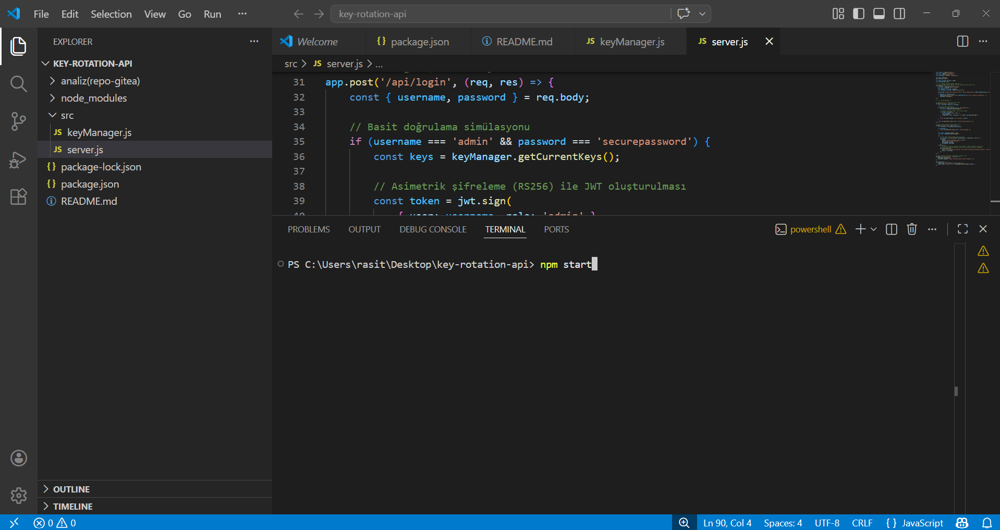
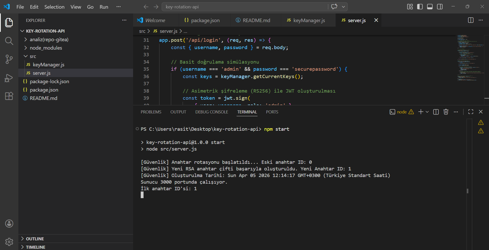
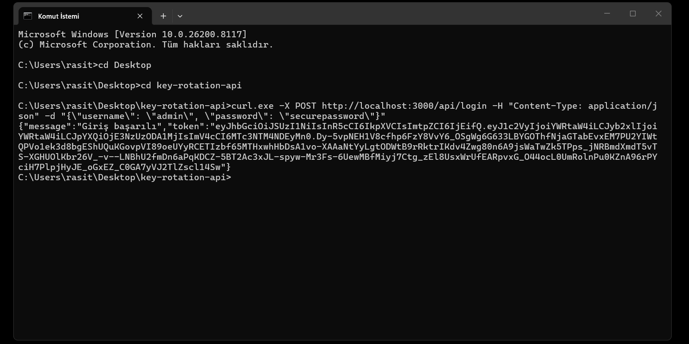
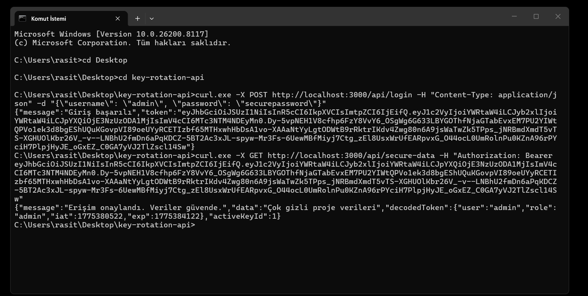
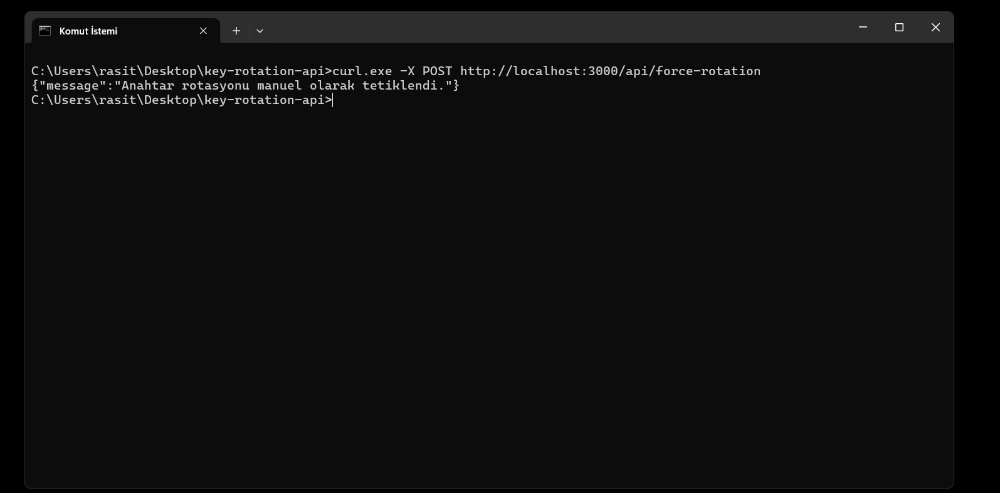
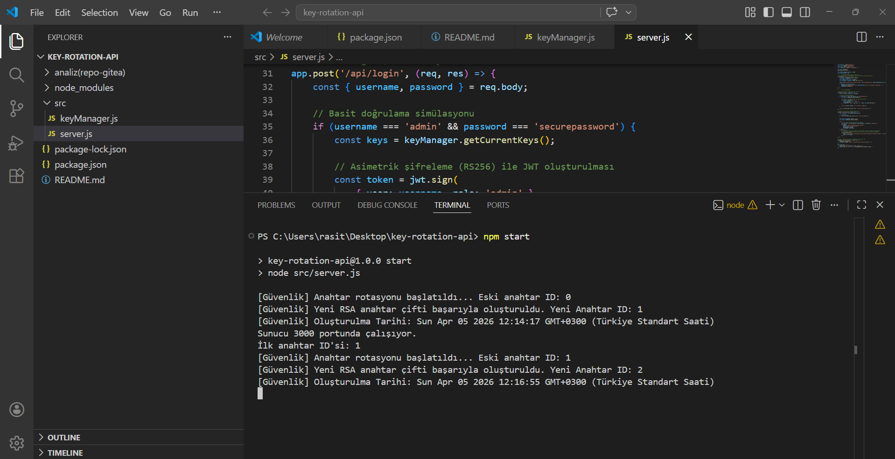
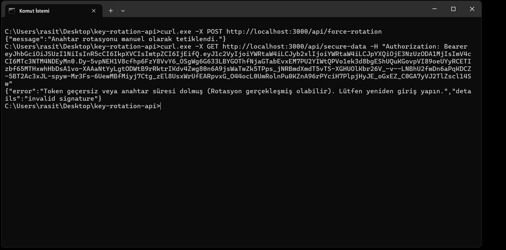

# Güvenli Web Yazılımı: 90 Günlük Asimetrik Anahtar Rotasyonu (Key Rotation) API


**Öğrenci:** Raşit ÇANKAYA (2420191006)  
**Üniversite / Bölüm:** İstinye Üniversitesi - Bilişim Güvenliği Teknolojisi (İÖ)  
**Ders:** Güvenli Web Yazılımı Geliştirme  
**Danışman:** [Danışman Adını Buraya Yazın]  

---

## 📑 İçindekiler
1. [Projenin Amacı ve Kurumsal Dayanağı](#-projenin-amacı-ve-kurumsal-dayanağı)
2. [Kullanılan Teknolojiler ve Bağımlılıklar](#-kullanılan-teknolojiler-ve-bağımlılıklar-dependencies)
3. [Proje Dosya Yapısı](#-proje-dosya-yapısı)
4. [Kurulum ve Çalıştırma Adımları](#-kurulum-ve-çalıştırma-adımları)
5. [Sık Karşılaşılan Hatalar ve Çözümleri](#️-sık-karşılaşılan-hatalar-ve-çözümleri-troubleshooting)
6. [Test Senaryoları](#-test-senaryoları-eğitmen-ve-denetçi-için)
7. [Ekran Görüntüleri ile Adım Adım Çalışma Kanıtı](#-ekran-görüntüleri-ile-adım-adım-çalışma-kanıtı)
8. [Lisans](#-lisans)

---

## 📌 Projenin Amacı ve Kurumsal Dayanağı

*"Aynı anahtarı 5 yıl kullanırsan biri kopyasını mutlaka çıkarır."* prensibinden yola çıkılarak geliştirilen bu sistem, statik şifrelerin ve anahtarların oluşturduğu güvenlik açıklarını kapatmayı hedefler. 

Bu mimari, **ISO 27001 Bilgi Güvenliği Yönetim Sistemi** denetimlerinde kritik bir rol oynayan **Ek A (Kriptografi ve Anahtar Yönetimi)** standartlarına doğrudan uyumluluk sağlar. Kriptografik anahtarların belirli periyotlarla yenilenmesi, olası bir sızıntı durumunda geçmişte sızan verilerin ve gelecekteki iletişimlerin güvenliğini (Forward Secrecy) garanti altına alarak, kurumsal veri ihlali risklerini ve doğabilecek hukuki yükümlülükleri minimize eder.

💡 *Daha fazla mimari ve teknik detay için [docs/architecture.md](./docs/architecture.md) dosyasına göz atabilirsiniz.*

---

## 📦 Kullanılan Teknolojiler ve Bağımlılıklar (Dependencies)

* **`express` (v4.18+):** Uygulamanın web sunucusu altyapısı ve HTTP API uç noktaları.
* **`jsonwebtoken` (v9.0+):** Asimetrik (RS256) algoritması ile JWT üretimi ve doğrulaması.
* **`node-cron` (v3.0+):** Anahtar rotasyon sürecini her gün denetleyen zamanlanmış görev yöneticisi.
* **`crypto` (Node.js Dahili):** 2048-bit RSA Public/Private Key çiftlerinin güvenli üretimi.

---

## 📂 Proje Dosya Yapısı
```text
key-rotation-api/
├── package.json
├── docs/
│   └── architecture.md  (Sistem mimarisi dokümantasyonu)
├── src/
│   ├── keyManager.js    (Anahtar üretim ve rotasyon mantığı)
│   └── server.js        (API sunucusu ve Cron Job)
└── README.md            (Ana Dokümantasyon)
```
## 🚀 Kurulum ve Çalıştırma Adımları

Gereksinimler: 

Bilgisayarınızda Node.js yüklü olmalıdır.

Proje dosyalarını bir klasöre çıkarın ve VS Code ile açın.

VS Code terminalini (Terminal > New Terminal) açın ve bağımlılıkları yükleyin:

```bash
npm install
```

Sunucuyu başlatın:

```bash
npm start
```
Konsolda [Güvenlik] Yeni RSA anahtar çifti başarıyla oluşturuldu. mesajını gördüğünüzde sistem API isteklerine hazırdır.

##⚠️ Sık Karşılaşılan Hatalar ve Çözümleri (Troubleshooting)

Windows PowerShell Hatası (npm : File ... cannot be loaded...): Windows PowerShell, güvenlik gereği npm scriptlerini engelleyebilir. 

Çözüm:

PowerShell'i Yönetici olarak çalıştırın.

Şu komutu girip Enter'a basın: 

```bash
Set-ExecutionPolicy RemoteSigned
```

Gelen uyarıya Y yazarak onay verin.

## 🧪 Test Senaryoları (Eğitmen ve Denetçi İçin)

Projenin rotasyon mantığını anında test edebilmek için özel bir uç nokta eklenmiştir. Standart bir Komut İstemcisi (CMD) üzerinden test edebilirsiniz.

1. Sisteme Giriş ve Token Alımı:

```bash
curl.exe -X POST http://localhost:3000/api/login -H "Content-Type: application/json" -d "{\"username\": \"admin\", \"password\": \"securepassword\"}"
```
(Dönen "token" değerini kopyalayın)

2. Güvenli Veriye Erişim Doğrulaması:
   
```bash
curl.exe -X GET http://localhost:3000/api/secure-data -H "Authorization: Bearer <TOKEN>"
```

3. Rotasyonu Manuel Tetikleme (Zaman Atlaması Simülasyonu):

```bash
curl.exe -X POST http://localhost:3000/api/force-rotation
```

4. Rotasyon Sonrası Güvenlik Kanıtı (Erişim Reddi - Invalidation):
2. adımı aynı token ile tekrar çalıştırın.

Anahtar değiştiği için sistem HTTP 403 Forbidden (invalid signature) hatası fırlatacaktır. Bu, rotasyon mekanizmasının eski anahtarları sızmaya karşı başarıyla imha ettiğinin matematiksel kanıtıdır.

## 📸 Ekran Görüntüleri ile Adım Adım Çalışma Kanıtı

Aşağıdaki görseller, sistemin yerel ortamda (localhost) test edilme aşamalarını ve rotasyon mekanizmasının başarılı bir şekilde çalıştığını kanıtlamaktadır.

### Sunucunun Başlatılması ve İlk Anahtarın Üretimi
Sunucu `npm start` komutu ile ayağa kaldırıldığında, sistem otomatik olarak ilk RSA anahtar çiftini (ID: 1) üretir ve trafiğe hazır hale gelir.



### 1. Sisteme Giriş ve Token Alımı
Kullanıcı kimlik bilgileriyle API'ye istek atılır ve sisteme erişim için şifrelenmiş bir JWT elde edilir.


### 2. Güvenli Veriye Erişim
Alınan token, yetkilendirme başlığına (Authorization: Bearer) eklenerek korumalı veriye ulaşılır. Sistem token'ı doğrular ve 200 OK yanıtı ile veriyi döner.


### 3. Rotasyonu Manuel Tetikleme (90 Gün Simülasyonu)
Sistemin rotasyon mekanizmasını test etmek için `force-rotation` uç noktasına istek atılır.


Bu istek sonucunda sunucu tarafında eski anahtar kullanımdan kaldırılır ve anında **Yeni Anahtar ID: 2** üretilir. Bu işlem sunucu loglarına aşağıdaki gibi yansır:


### 4. Güvenlik Kanıtı: Rotasyon Sonrası Erişim Reddi (Invalidation)
Sistemin temel amacı olan "eski sızmış şifrelerin iptali" durumunu kanıtlamak için, **2. adımda kullanılan eski token ile sisteme tekrar erişilmeye çalışılır.** Anahtar değiştiği için sistem eski imzayı tanımaz ve **HTTP 403 (invalid signature)** hatası fırlatarak erişimi güvenli bir şekilde keser.

